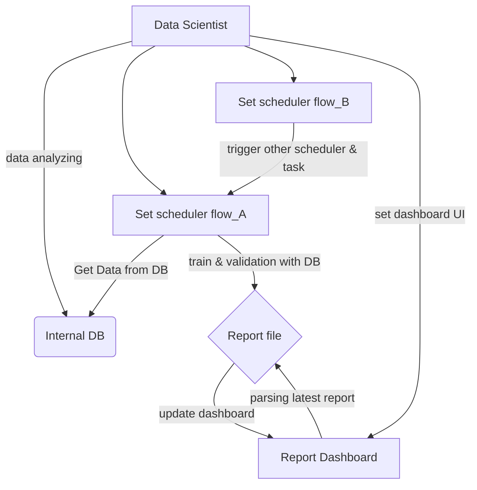
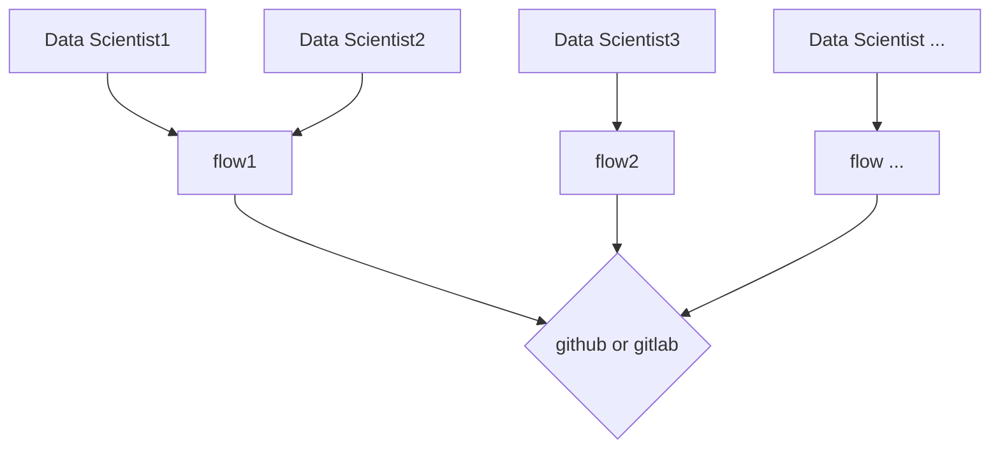

# How to use this flows in Data Analytics job

```mermaid
graph TD
A[Data Scientist] -->|data analyzing| B(Internal DB)
A --> BB[Set scheduler flow_A]
BB --> |Get Data from DB|B
A --> BC[Set scheduler flow_B]
BB --> |train & validation with DB|C{Report file}
BC --> |trigger other scheduler & task|BB
A --> |set dashboard UI|BD[Report Dashboard]
BD --> |parsing latest report|C
C --> |update dashboard|BD
```

# how to manage separated flow or task

```mermaid
graph TD
AA[Data Scientist1] --> BA[flow1]
AB[Data Scientist2] --> BA[flow1]
AC[Data Scientist3] --> BB[flow2] 
AD[Data Scientist ...] --> BC[flow ...]
BA --> C{github or gitlab}
BB --> C{github or gitlab}
BC--> C{github or gitlab}
```

    
