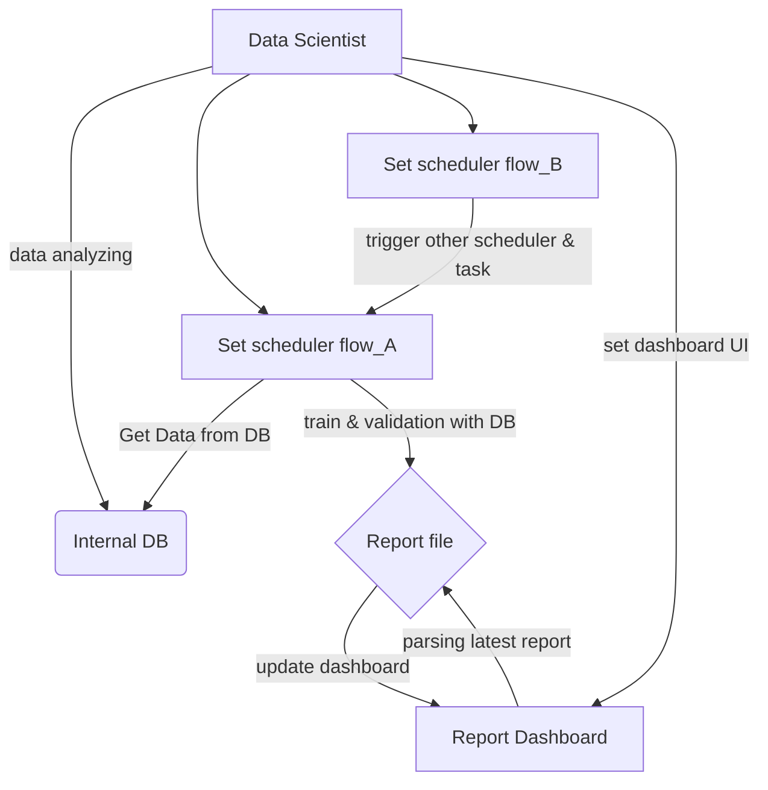

```mermaid
graph TD
A[Data Scientist] -->|data analyzing| B(Internal DB)
A --> BB[Set scheduler flow_A]
BB --> |Get Data from DB|B
A --> BC[Set scheduler flow_B]
BB --> |train & validation with DB|C{Report file}
BC --> |trigger other scheduler & task|BB
A --> |set dashboard UI|BD[Report Dashboard]
BD --> |parsing latest report|C
C --> |update dashboard|BD
```
    
